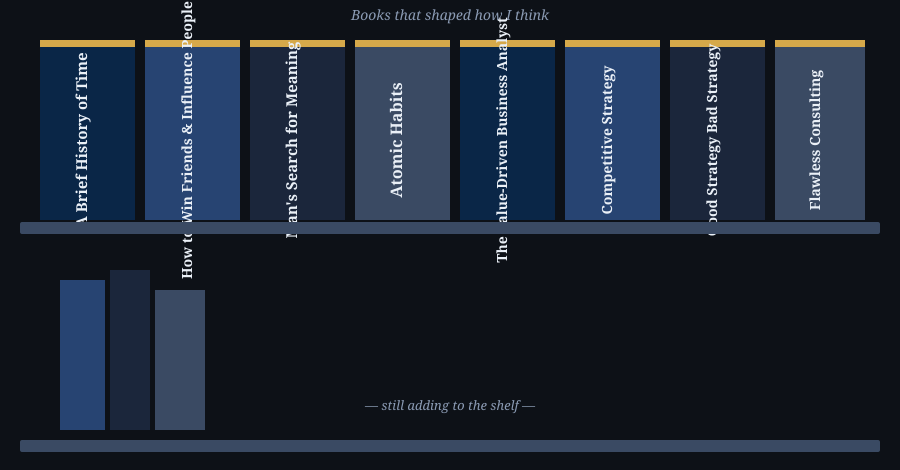

  # Atyyyychos      
 
"A slime with a destination."

 
 

<table width="100%" style="border-collapse:collapse; border:2px solid #274472;">
<tr>

<td width="50%" valign="top" style="padding:22px; border-right:2px solid #274472;">

### 👤 My Details & Socials

- 🇳🇵 Based in Nepal. 
- 💼 Business Development → Business Analysis
- 🌐 [Portfolio](https://your-portfolio-link.com)
- 🔗 [LinkedIn](https://www.linkedin.com/in/abhishek-luitel/)
- ✉️ [Email](atychos4@gmail.com)
- X [Twitter-X](https://x.com/AbhishekLuite10)

 

### 🛠️ Toolkit

 

### 📖 Currently Learning

- [x] ECBA fundamentals — BABOK's six knowledge areas
- [x] BRD masterclass — 12-section BRD, projects and case studies
- [x] Excel analytics toolkit — 15 sections, 5-phase roadmap
- [x] Python fundamentals — small logic-building projects
- [x] Case Study for Business Consulting

</td>

<td width="50%" valign="top" style="padding:22px;"> 

### 🍥 Favorite Anime

  

### 📚 Favorite Books

  

### 🧠 Topics I Nerd Out On

</td>

</tr>
</table>
